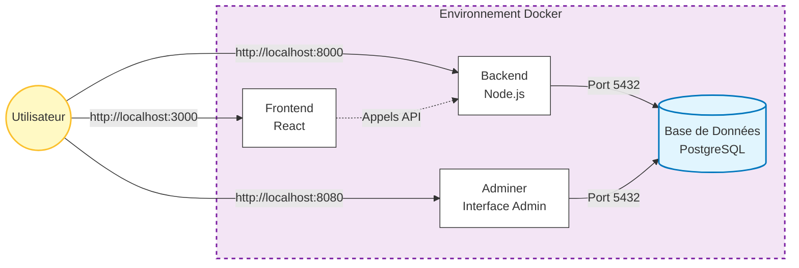

# IPSSI Security Patch Project

Ce projet est une version corrigée et sécurisée d'une application initialement vulnérable. 
Il a été modernisé pour utiliser **Docker**, une architecture **MVC**, et une base de données **PostgreSQL**.

## Démarrage Rapide

1. **Pré-requis** : Avoir Docker Desktop installé et lancé.
2. **Lancer l'application** :
   ```bash
   docker compose up --build -d
   ```
3. **Accéder aux services** :
   - **Frontend** : [http://localhost:3000](http://localhost:3000)
   - **Backend API** : [http://localhost:8000](http://localhost:8000)
   - **Adminer (BDD)** : [http://localhost:8080](http://localhost:8080)

## Architecture Docker

L'application est composée de 4 conteneurs isolés qui communiquent via un réseau Docker interne.



### Services

| Service | Image / Technologie | Port Hôte | Description |
| :--- | :--- | :--- | :--- |
| **frontend** | `nginx:alpine` (Build React) | **3000** | Interface utilisateur sécurisée (XSS protected). |
| **backend** | `node:18-alpine` | **8000** | API REST sécurisée (Helmet, CORS, Bcrypt). |
| **db** | `postgres:15-alpine` | **5432** | Base de données relationnelle robuste. |
| **adminer** | `adminer` | **8080** | Interface graphique légère pour gérer la BDD. |

## Correctifs de Sécurité Appliqués

- **Injection SQL** : Corrigée via ORM Sequelize (Requêtes paramétrées).
- **XSS** : Corrigé via React et headers Helmet.
- **Fuite de Données** : Mots de passe utilisateurs hachés avec **Bcrypt**.
- **Environnement** : Isolation complète via Docker.
